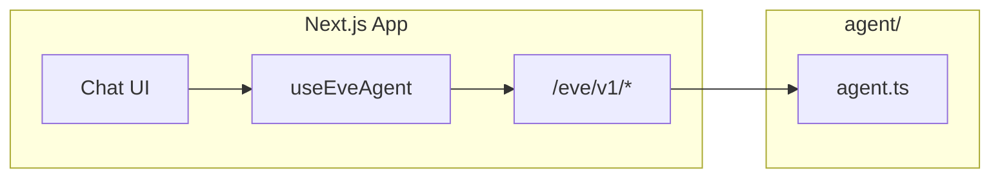

# План: Eve Chat MVP (Next.js + AI Elements)

Пошаговый план для самостоятельной реализации в Cursor.

**Как работать с этим планом:** открывайте один этап, делайте его, отмечайте чекбокс. Если что-то непонятно — спросите в чате: *«объясни этап N»* или *«зачем нужен withEve»*. Я объясню что делать и зачем.

**Цель MVP:** один экран чата, монолит Next.js + Eve, без sidebar, auth и истории.

**Выбранный UI-стек:** `useEveAgent` (Eve) + **AI Elements** (shadcn/ui).

---

## Текущий статус проекта


| Этап                       | Статус                                                                         |
| -------------------------- | ------------------------------------------------------------------------------ |
| 0 — Подготовка             | проверить самостоятельно                                                       |
| 1a — `eve init`            | **сделано** — есть `agent/`, `package.json`, `pnpm dev`                        |
| 1b — Next.js + `withEve()` | **ещё нет** — в проекте пока только Eve backend, без `app/` и `next.config.ts` |
| 2–7                        | не начато                                                                      |


---

## Архитектура (кратко)




| Слой           | Технология        | Зачем                                       |
| -------------- | ----------------- | ------------------------------------------- |
| Backend агента | `agent/` + Eve    | Модель, инструкции, tools                   |
| HTTP API       | `/eve/v1/session` | Durable-сессии, стриминг NDJSON             |
| React state    | `useEveAgent`     | Превращает события Eve в `UIMessage[]`      |
| UI             | AI Elements       | Готовая отрисовка messages, markdown, input |


**Важно:** не используйте `useChat` и `/api/chat` — Eve уже даёт свой API. AI Elements здесь только как UI-компоненты, не как transport.

---

## Этап 0 — Подготовка

- [x] Убедиться, что Node.js 18+ установлен (в проекте указан Node 24.x)
- [x] Иметь API-ключ или Vercel AI Gateway (для локальной разработки Eve подскажет в CLI)

**Зачем:** Eve и Next.js требуют современный Node; без ключа модель не ответит.

**Проверка:** `node -v` → v18+ (лучше 20+).

---

## Этап 1a — Скелет Eve (backend агента)

- [x] Создать проект в этой папке
- [x] Появилась папка `agent/` с `agent.ts` и `instructions.md`
- [x] `pnpm dev` / `npm run dev` запускает Eve

### Как делали (важно для повторения)

`eve init .` **не работает**, если папка не пустая. Решение:

```bash
cd /Users/krylovdev/DEV/eve-practice
mv PLAN.md ../PLAN.md.bak
npx eve@0.19.0 init .
mv ../PLAN.md.bak PLAN.md
```

**Не путать:**

- `npx eve@0.19.0` без `init` → ошибка *«Could not resolve an eve agent root»* (ищет уже существующий `agent/`)
- `npx eve@0.19.0 init .` → создаёт проект

### Зачем

- `**agent/`** — файловая конфигурация агента
- `**eve dev`** — локальный сервер с API `/eve/v1/`* и TUI в терминале

### Текущая структура (после init)

```
eve-practice/
├── agent/
│   ├── agent.ts
│   ├── instructions.md
│   └── channels/eve.ts
├── package.json
└── PLAN.md
```

### Проверка

```bash
pnpm dev
```

Eve должен стартовать (обычно `http://localhost:3000` для API).

---

## Этап 1b — Добавить Next.js (монолит)

- [ ] Установлен Next.js + React
- [ ] В `next.config.ts` подключён `withEve()`
- [ ] Есть `app/layout.tsx` и `app/page.tsx`
- [ ] Один `pnpm dev` поднимает и Next.js, и Eve routes

### Что сделать

Вариант A — если Eve CLI умеет добавить web-слой (проверьте `npx eve@0.19.0 init --help`).

Вариант B — вручную поверх существующего Eve-проекта:

```bash
pnpm add next react react-dom
pnpm add -D @types/react @types/react-dom
```

Создать `next.config.ts`:

```ts
import type { NextConfig } from "next";
import { withEve } from "eve/next";

const nextConfig: NextConfig = {};

export default withEve(nextConfig);
```

Добавить минимальный `app/layout.tsx`, `app/page.tsx`, `app/globals.css`.

Обновить `package.json` scripts (если нужно):

```json
"dev": "next dev"
```

или оставить `eve dev`, если он уже проксирует Next — смотрите вывод после scaffold.

### Зачем

- `**withEve()**` — монтирует `/eve/v1/*` на том же origin, что и Next.js → браузеру не нужен отдельный backend и нет CORS
- **Монолит** — один деплой, UI и агент в одном приложении

### Ожидаемая структура (после 1b)

```
eve-practice/
├── agent/
├── app/
│   ├── layout.tsx
│   └── page.tsx
├── next.config.ts      # withEve(...)
└── package.json
```

### Проверка

`http://localhost:3000` — открывается страница Next.js.

---

## Этап 2 — Настроить агента (минимально)

- [x] В `agent/instructions.md` — системный промпт (базовый уже есть)
- [x] В `agent/agent.ts` — модель (`anthropic/claude-sonnet-5`)
- [x] При необходимости — `.env.local` с ключами

### Зачем

- **instructions.md** — поведение бота без пересборки UI
- **agent.ts** — какая модель, лимиты, опции runtime

### Проверка (опционально)

```bash
curl -X POST http://localhost:3001/eve/v1/session \
  -H 'content-type: application/json' \
  -d '{"message":"Hi"}'
```

Должен вернуться `continuationToken` и заголовок `x-eve-session-id`.

---

## Этап 3 — shadcn/ui

- [ ] Инициализирован shadcn (`components.json` появился)
- [ ] Tailwind на CSS variables (режим по умолчанию shadcn)
- [ ] Базовые ui-компоненты на месте (button, input — подтянутся с AI Elements)

### Что сделать

npm install -D tailwindcss @tailwindcss/postcss postcss

// postcss.config.mjs в корне
const config = {
  plugins: {
    "@tailwindcss/postcss": {},
  },
};

export default config;

// app/globals.css
@import "tailwindcss";

// tsconfig.json
compileOptions: {
  "paths": {
    "@/*": ["./*"]
  }
}

```bash
npx shadcn@latest init -t next -d
```

Рекомендации при init:

- Style: **New York** или **Default**
- CSS variables: **yes**
- Alias: `@/components`

### Зачем

AI Elements — registry поверх shadcn: компоненты копируются в ваш репозиторий. Без shadcn init CLI AI Elements не установится.

### Проверка

- Есть `components.json`
- `app/globals.css` содержит CSS variables для темы

---

## Этап 4 — AI Elements (UI чата)

- [ ] Установлены: `conversation`, `message`, `prompt-input`
- [ ] (Опционально позже) `reasoning`, `tool`
- [ ] Папка `components/ai-elements/` существует

### Что сделать

```bash
npx ai-elements@latest add conversation message prompt-input
```

### Зачем каждый компонент


| Компонент                     | Роль                                       |
| ----------------------------- | ------------------------------------------ |
| `Conversation`                | Контейнер + auto-scroll к новым сообщениям |
| `Message` / `MessageResponse` | Пузыри + markdown/streaming текста         |
| `PromptInput`                 | Поле ввода, send, stop                     |


### Проверка

`pnpm dev` — импорты из `@/components/ai-elements/...` резолвятся без ошибок.

---

## Этап 5 — Компонент `Chat` (связка Eve + UI)

- [x] Создан `components/chat.tsx` с `'use client'`
- [x] Используется `useEveAgent` из `eve/react`
- [x] Сообщения рендерятся из `data.messages`
- [x] `send(text)` на submit, `stop()` при стриминге
- [x] Обработан `status` и `error`

### Зачем

Единственный glue-слой между Eve и UI:

- Eve даёт `data.messages` в формате **AI SDK `UIMessage`** (`parts`: `text`, `reasoning`, `tool-*`)
- AI Elements рисует эти `parts` — `useChat` не нужен

### Минимальный каркас

```tsx
"use client";

import { useEveAgent } from "eve/react";
import { useState } from "react";
import {
  Conversation,
  ConversationContent,
} from "@/components/ai-elements/conversation";
import {
  Message,
  MessageContent,
  MessageResponse,
} from "@/components/ai-elements/message";

export function Chat() {
  const { data, status, send, stop, error } = useEveAgent();
  const [input, setInput] = useState("");
  const busy = status === "submitted" || status === "streaming";

  return (
    <div className="flex h-dvh flex-col">
      <Conversation className="flex-1">
        <ConversationContent>
          {data.messages.map((message) => (
            <Message key={message.id} from={message.role}>
              <MessageContent>
                {message.parts.map((part, index) => {
                  if (part.type === "text") {
                    return (
                      <MessageResponse key={index}>
                        {part.text}
                      </MessageResponse>
                    );
                  }
                  return null;
                })}
              </MessageContent>
            </Message>
          ))}
        </ConversationContent>
      </Conversation>

      <form
        className="border-t p-4"
        onSubmit={(e) => {
          e.preventDefault();
          const text = input.trim();
          if (!text || busy) return;
          send(text);
          setInput("");
        }}
      >
        <input
          className="w-full rounded border px-3 py-2"
          value={input}
          onChange={(e) => setInput(e.target.value)}
          disabled={busy}
          placeholder="Напишите сообщение..."
        />
        {busy ? (
          <button type="button" onClick={stop}>Stop</button>
        ) : (
          <button type="submit">Send</button>
        )}
      </form>

      {error ? (
        <p className="px-4 text-sm text-red-600">{error.message}</p>
      ) : null}
    </div>
  );
}
```

После установки `prompt-input` замените `<form>` на `PromptInput` — API смотрите в сгенерированном файле.

### Проверка

- Отправка сообщения → user bubble
- Ответ ассистента стримится
- Stop прерывает генерацию

---

## Этап 6 — Подключить на страницу

- [x] `app/page.tsx` рендерит `<Chat />`

```tsx
import { Chat } from "@/components/chat";

export default function Home() {
  return <Chat />;
}
```

### Проверка

`http://localhost:3000` — полноэкранный чат end-to-end.

---

## Этап 7 — Полировка MVP (опционально)

- [ ] Тёмная тема
- [ ] Пустое состояние («Начните диалог»)
- [ ] `Reasoning` / `Tool` если агент вызывает tools
- [ ] Loading: `status === "submitted"` → «Думаю...»

---

## Что НЕ входит в MVP (отложить)


| Фича                | Почему отложить                 | Куда смотреть потом                                                   |
| ------------------- | ------------------------------- | --------------------------------------------------------------------- |
| Sidebar + история   | Нужна БД                        | [eve-chat-template](https://github.com/vercel-labs/eve-chat-template) |
| Auth                | Better Auth, OAuth              | template `lib/auth.ts`                                                |
| Resume после reload | Persist `SessionState` + events | template `agent-chat.tsx`                                             |
| Rate limits         | Redis / Upstash                 | template `lib/rate-limit.ts`                                          |


---

## Справка: альтернативы UI


| Вариант                   | Когда                                            |
| ------------------------- | ------------------------------------------------ |
| **AI Elements** (выбрано) | Быстрый ChatGPT-like UI, официальный стек Vercel |
| Кастомный Tailwind        | Минимум зависимостей, без markdown               |
| Куски eve-chat-template   | HITL, resume, Eve-специфичные tool UI            |
| assistant-ui              | Сложный agent UI, но нужен адаптер под Eve       |


### Сравнение


| Вариант           | Скорость старта | Совместимость с Eve    | Markdown/Tools |
| ----------------- | --------------- | ---------------------- | -------------- |
| **AI Elements**   | Высокая         | Отличная (`UIMessage`) | Из коробки     |
| Кастомный UI      | Средняя         | Отличная               | Вручную        |
| eve-chat-template | Средняя         | Идеальная              | Из коробки     |
| assistant-ui      | Низкая для Eve  | Нужен адаптер          | Из коробки     |


---

## Чеклист готовности MVP

- [ ] `pnpm dev` стартует без ошибок
- [ ] `withEve` в `next.config.ts`
- [ ] `useEveAgent` + AI Elements на одной странице
- [ ] Сообщения стримятся
- [ ] Stop работает
- [ ] Markdown в ответах рендерится

---

## Полезные ссылки

- [Eve docs](https://eve.dev/docs)
- [Eve frontend / useEveAgent](https://eve.dev/docs/guides/frontend/overview)
- [AI Elements](https://elements.ai-sdk.dev)
- [Eve chat template](https://github.com/vercel-labs/eve-chat-template)
- [Как устроен template](https://github.com/vercel-labs/eve-chat-template/blob/main/docs/how-the-chatbot-works.md)

---

## Как спрашивать в Cursor

- *«Объясни этап 1b — как добавить Next.js к существующему Eve»*
- *«Этап 5: useEveAgent возвращает пустой data.messages»*
- *«Помоги заменить form на PromptInput»*

Я объясняю **что** и **зачем**; код — по запросу или если застряли.